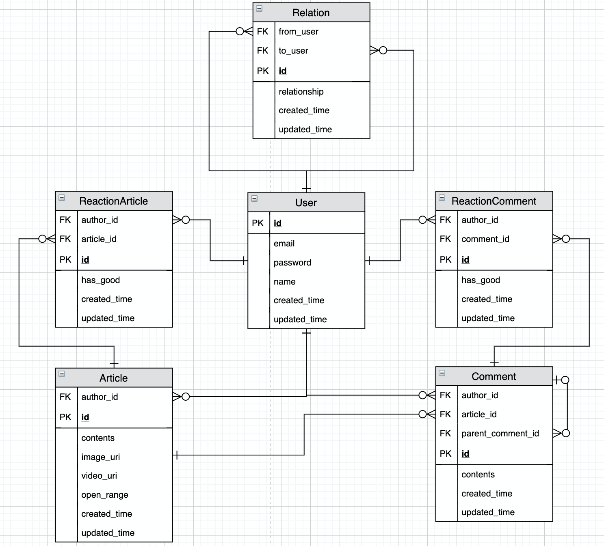

# SUNBOOK
> 페이스북을 따라만드는 프로젝트입니다.
> 이 레포지토리는 SUNBOOK 프로젝트를 리펙토링 및 확장하는 레포지토리입니다.
> 원본 레포지토리는 아래의 Reference에 링크를 첨부하였습니다.  


## 기술 스택
- Backend
    - Java8
    - Spring Boot2.1
    - JPA
    - Gradle
    - JUnit5
- Infra
    - MySQL
    - H2
    - AWS
    - S3
    - Docker
    - Nginx
- Frontend
    - javascript(VanillaJs)
    - HTML/CSS
    - Fetch API
    
    
## 로컬에서 빌드 및 실행하기
### 터미널 환경
- Git, Java 는 설치되어 있다고 가정한다.

```
$ git clone https://github.com/CODEMCD/sunbook.git
$ cd sunbook
$ ./gradlew clean build
$ java -jar build/libs/sunbook-0.0.1-SNAPSHOT.jar
```

- 접속 Base URI: `http://localhost:8080`


## 엔티티 구조




## 개발 일지
- [개발 일지](https://www.notion.so/69767bf2f8a64ae0961d560007685ca6?v=11a7699b0b424b8b890a1545af7be616)


## Reference
- [SUNBOOK 원본 레포지토리](https://github.com/1-sunshine/miniprojects-2019)
- [소개 영상](https://youtu.be/Arb29ai26GU)
- [WIKI](https://github.com/1-sunshine/miniprojects-2019/wiki)